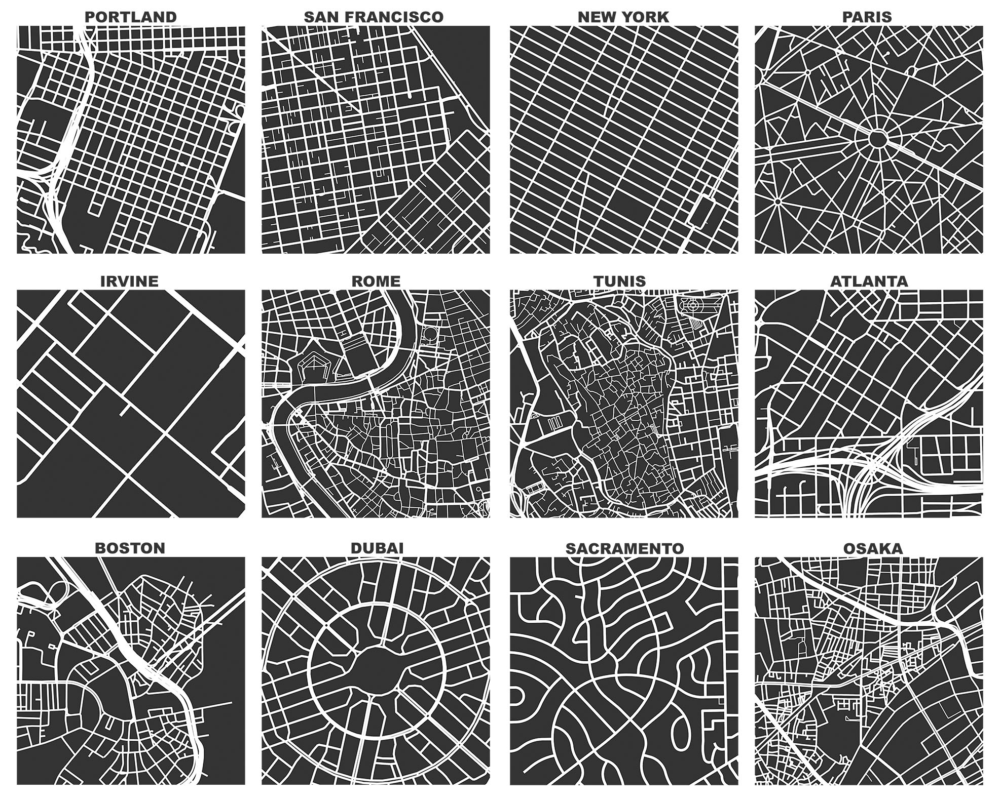
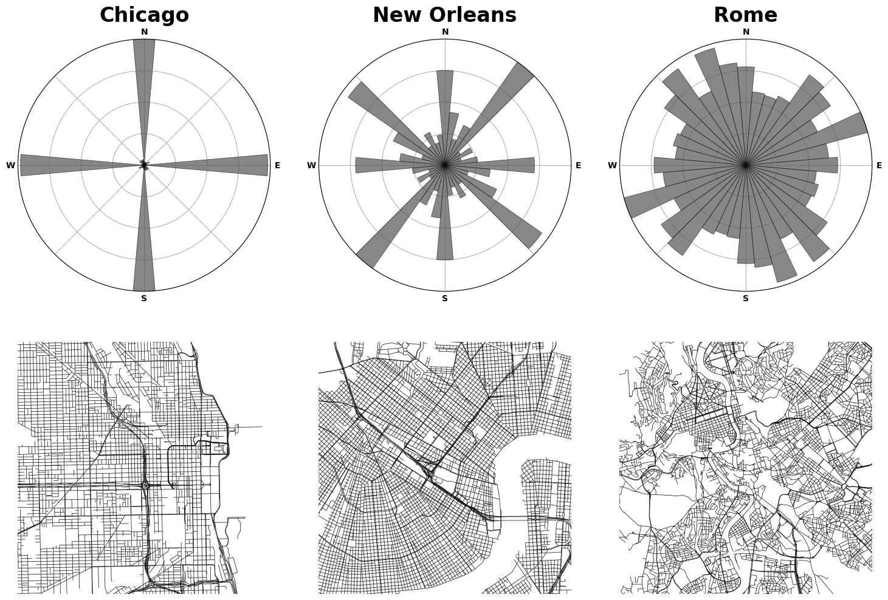

# TileMani 

TileMani (for Tile Mani(pulation) or Tile Mani(ac)) is a collection of tools to
- retreive street network and geometric (eg. buildings, POIs) from OSM database
- rasterize the retrieved data into a `np.array` with customizable style (e.g.
width, color per road type, building type, green area, etc),
- compute spatial features (eg. average number of intersections, road bearings,
between centrality, or density-based metrics like FSI, GSI),
- build/train a model of urban space from graph-, or grid- structured data 

Reference/Image source:

Boeing, G. (2025). Modeling and Analyzing Urban Networks and Amenities with OSMnx. Geographical Analysis, doi:10.1111/gean.70009
